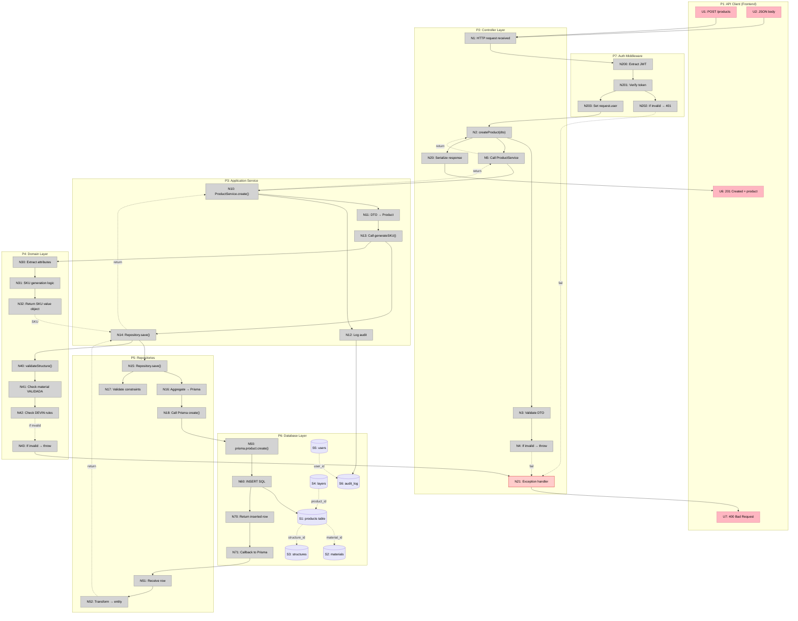

# Backend ODISEO — Breadboarding

## Overview

This breadboard maps a **typical HTTP request workflow** through the backend architecture. The example workflow is: **Create a new Product** (POST /products).

### Entry Point
Client submits `POST /products` with product data (name, material, structure, dimensions)

### Exit Point
API returns `201 Created` with product object including generated SKU

---

## Places (P)

| # | Place | Description |
|---|-------|-------------|
| P1 | API Gateway (Frontend) | Client making HTTP requests |
| P2 | NestJS Controller Layer | REST endpoint handlers |
| P3 | Application Services | Business logic orchestration |
| P4 | Domain Layer | Rich domain model with validations |
| P5 | Repositories | Data access abstraction |
| P6 | Prisma + NEON | Database persistence |
| P7 | Auth Middleware | JWT validation and guards |

---

## UI Affordances (REST Endpoints)

| # | Place | Component | Affordance | Control | Wires Out | Returns To |
|---|-------|-----------|------------|---------|-----------|------------|
| U1 | P1 | Client | POST /products | HTTP call | → N1 | — |
| U2 | P1 | Client | JSON body: `{name, material, structure, dimensions}` | payload | → N1 | — |
| U3 | P2 | products.controller | `@Post()` endpoint | route | → N2 | ← N20 |
| U4 | P2 | products.controller | `@Body() createProductDto` | validate input | → N3 | — |
| U5 | P2 | products.controller | `@UseGuards(JwtAuthGuard)` | auth check | → P7 | — |
| U6 | P1 | Client | `201 Created + {id, sku, name, ...}` | response | — | ← N20 |
| U7 | P1 | Client | `400 Bad Request + errors` | error response | — | ← N21 |

---

## Code Affordances (Handlers, Services, Repositories, Domain)

### A1: Controller Layer

| # | Place | Component | Affordance | Control | Wires Out | Returns To |
|---|-------|-----------|------------|---------|-----------|------------|
| N1 | P2 | products.controller | HTTP request arrives | receive | → N2 | — |
| N2 | P2 | products.controller | `createProduct(createProductDto)` | call | → N3, → N5 | — |
| N3 | P2 | products.controller | Validate DTO structure | class-validator | → N4 | — |
| N4 | P2 | products.controller | If validation fails → throw HttpException | conditional | → N21 | — |
| N5 | P2 | products.controller | Call ProductService.create() | call | → N10 | — |
| N20 | P2 | products.controller | Send response `201 Created + product` | serialize | — | → U6 |
| N21 | P2 | products.controller | Exception handler (catch error) | catch | → U7 | — |

### A2: Application Service Layer

| # | Place | Component | Affordance | Control | Wires Out | Returns To |
|---|-------|-----------|------------|---------|-----------|------------|
| N10 | P3 | products.service | `create(createProductDto)` | call | → N11, → N12 | → N5 |
| N11 | P3 | products.service | Map DTO → Product domain entity | construct | → N13 | — |
| N12 | P3 | products.service | Log action (audit) | log | → S6 | — |
| N13 | P3 | products.service | Call Product.generateSKU() | call | → N14 | — |
| N14 | P3 | products.service | Call productRepository.save() | call | → N15 | → N10 |

### A3: Domain Layer (Rich Model)

| # | Place | Component | Affordance | Control | Wires Out | Returns To |
|---|-------|-----------|------------|---------|-----------|------------|
| N14 | P4 | Product (aggregate) | `generateSKU()` | method | → N30, → N31 | → N13 |
| N30 | P4 | Product | Extract product attributes (material, structure, format) | read | — | → N14 |
| N31 | P4 | Product | Apply SKU generation logic (deterministic) | logic | → N32 | — |
| N32 | P4 | Product | Return immutable SKU value object | return | — | → N14 |
| N40 | P4 | Product | `validateStructure()` | method | → N41, → N42 | — |
| N41 | P4 | Product | Check material is VALIDADA | validate | → N43 | — |
| N42 | P4 | Product | Check layers are valid per DEVIN rules | validate | → N43 | — |
| N43 | P4 | Product | If invalid → throw DomainException | conditional | → N21 | — |

### A4-A5: Repository & Data Access

| # | Place | Component | Affordance | Control | Wires Out | Returns To |
|---|-------|-----------|------------|---------|-----------|------------|
| N15 | P5 | products.repository | `save(product)` | call | → N16, → N17 | → N14 |
| N16 | P5 | products.repository | Map Product aggregate → Prisma shape | transform | → N18 | — |
| N17 | P5 | products.repository | Validate constraints before insert | check | → N43 | — |
| N18 | P5 | products.repository | Call Prisma `product.create()` | ORM call | → N50 | ← N51 |

### A6: Database (Prisma + NEON)

| # | Place | Component | Affordance | Control | Wires Out | Returns To |
|---|-------|-----------|------------|---------|-----------|------------|
| N50 | P6 | Prisma | `await prisma.product.create({data})` | execute | → N60 | → N18 |
| N60 | P6 | NEON PostgreSQL | INSERT INTO products (...) VALUES (...) | SQL execute | → N70 | ← N71 |
| N70 | P6 | NEON PostgreSQL | Return inserted row with id, created_at | return row | — | → N60 |
| N71 | P6 | NEON PostgreSQL | Return to Prisma client | callback | — | → N50 |
| N51 | P5 | products.repository | Receive row from Prisma | callback | → N52 | — |
| N52 | P5 | products.repository | Map Prisma row → Product entity | transform | — | → N15 |

### A7: Authentication

| # | Place | Component | Affordance | Control | Wires Out | Returns To |
|---|-------|-----------|------------|---------|-----------|------------|
| N200 | P7 | auth.middleware | Extract JWT from Authorization header | extract | → N201 | — |
| N201 | P7 | auth.middleware | Verify token signature & expiry | validate | → N202 | — |
| N202 | P7 | auth.middleware | If invalid → throw UnauthorizedException | conditional | → N21 | — |
| N203 | P7 | auth.middleware | If valid → set request.user with decoded token | set context | → N2 | — |

### A8: Dependency Injection & Module Wiring

| # | Place | Component | Affordance | Control | Wires Out | Returns To |
|---|-------|-----------|------------|---------|-----------|------------|
| N100 | P2 | ProductsModule | Register ProductsController | decorator | — | — |
| N101 | P2 | ProductsModule | Inject ProductService into controller | inject | — | — |
| N102 | P3 | ProductService | Inject ProductRepository | inject | → N15 | — |
| N103 | P7 | AuthModule | Register JwtAuthGuard | decorator | → N202 | — |

---

## Data Stores (Database Tables)

| # | Place | Store | Description | Schema |
|---|-------|-------|-------------|--------|
| S1 | P6 | `products` | Core product table | id (PK), sku (UNIQUE), name, material_id (FK), structure_id (FK), created_at, updated_at |
| S2 | P6 | `materials` | Material catalog | id (PK), name, density, validada_flag |
| S3 | P6 | `structures` | Structure catalog | id (PK), name, layers_max |
| S4 | P6 | `layers` | Product layers (M-to-M via product_id) | id (PK), product_id (FK), material_id (FK), thickness, order |
| S5 | P6 | `users` | User accounts | id (PK), email (UNIQUE), role_id (FK), created_at |
| S6 | P6 | `audit_log` | Audit trail | id (PK), user_id (FK), action, entity_type, entity_id, timestamp |

---

## Request/Response Cycle (Complete Flow)

### Happy Path: Create Product Successfully

```
U1/U2 (Client sends POST /products with body)
  ↓
N1 (HTTP request arrives at controller)
  ↓
N200/N201/N202/N203 (Auth middleware validates JWT)
  ↓
N2 (createProduct() handler receives request)
  ↓
N3/N4 (Validate DTO with class-validator)
  ↓
N5 (Route to ProductService)
  ↓
N10 (ProductService.create() orchestrates)
  ↓
N11 (Map DTO → Product aggregate)
  ↓
N13/N14 (Call Product.generateSKU())
  ↓
N30/N31/N32 (SKU generation logic)
  ↓
N40/N41/N42 (validateStructure() checks)
  ↓
N15 (Repository.save() persists)
  ↓
N16/N17 (Map aggregate → Prisma shape)
  ↓
N18 (Call Prisma create)
  ↓
N50 (Prisma executes with NEON)
  ↓
N60/N70/N71 (SQL INSERT, return row)
  ↓
N51/N52 (Transform row back to entity)
  ↓
N20 (Serialize to JSON)
  ↓
U6 (201 Created + product object)
```

### Error Path: Validation Fails

```
U1/U2 (Client sends invalid data)
  ↓
N3/N4 (DTO validation fails)
  ↓
N4 (Throw HttpException)
  ↓
N21 (Exception handler catches)
  ↓
U7 (400 Bad Request + error details)
```

---

## Mermaid Diagram: Complete Architecture



---

## Slicing for Implementation (Vertical Increments)

Based on the breadboard, here are vertical slices for incremental implementation:

| # | Slice | Mechanisms | Core Affordances | Demo |
|---|-------|-----------|------------------|------|
| V1 | **Auth + Basic Setup** | A1, A2, A8 | N200-N203, N100-N103 | JWT guard works, 401 on invalid token |
| V2 | **Domain Model: Product** | A3, A4 | N30-N32, N40-N43 | SKU generates, validations work |
| V3 | **Repositories + NEON** | A5, A6 | N15-N18, N50-N71, S1-S6 | Save to DB, retrieve row |
| V4 | **Controller + Service: Create** | A1, A2, A7 | N1-N5, N10-N14, N20-N21 | POST /products endpoint works |
| V5 | **Read Endpoints** | Controllers for GET /products, GET /products/:id | — | Retrieve products, filter by id |
| V6 | **Validations + Error Handling** | A3, A4 refactored | Comprehensive validation matrix | Invalid input returns 422 with details |
| V7 | **Catalogs + Seeders** | A11 + Prisma migrations | S2-S4 populated | Materiales, estructuras, formatos loaded |
| V8 | **Audit Logging + Middleware** | A7 enhanced | N12, S6 | Every action logged to audit_log |
| V9 | **Additional Modules** | ProductRequests, Portfolios, Users | Complete endpoint coverage | All CRUD endpoints working |

**V1 Demo:** "Create a test request with invalid JWT → 401 Unauthorized. Add valid JWT → request proceeds."

**V2 Demo:** "Product.generateSKU() with material=Steel, structure=Sandwich → generates deterministic SKU. Invalid material → throws error."

**V3 Demo:** "Save product to DB → Prisma executes INSERT → row appears in NEON → fetch and verify id, sku, timestamps."

**V4 Demo:** "POST /products with JWT token → 201 Created with full product object including generated SKU."

---

## Key Design Points

### 1. Layered Architecture
- **Controller**: HTTP handling, DTO validation, exception catching
- **Service**: Orchestration, audit logging, business logic coordination
- **Domain**: Rich model with methods (generateSKU, validateStructure), value objects (SKU, Dimensions)
- **Repository**: Data access abstraction, Prisma mapping
- **Middleware**: Cross-cutting concerns (auth, logging)

### 2. Error Handling
- **DTO validation fails** → HttpException(400)
- **Domain validation fails** → DomainException caught by controller → HttpException(422)
- **Database constraint violated** → Prisma error caught → HttpException(409 Conflict)
- **Auth fails** → UnauthorizedException(401)

### 3. Data Flow
- Inbound: DTO → Domain Entity → Persistence
- Outbound: DB Row → Domain Entity → DTO → JSON Response

### 4. Validations
- **DTO level** (class-validator): input format, required fields
- **Domain level** (aggregate methods): business rules (DEVIN, material validity, dimensions)
- **DB level** (Prisma constraints): uniqueness (SKU), foreign keys, NOT NULL

### 5. Dependency Injection
- All dependencies injected via NestJS @Injectable() and module providers
- No hard-coded singletons or globals
- Easy to mock for testing

---

**Status**: Breadboarding complete, ready for sliced implementation plans  
**Next**: Create detailed implementation plan for V1 (Auth + Setup)
